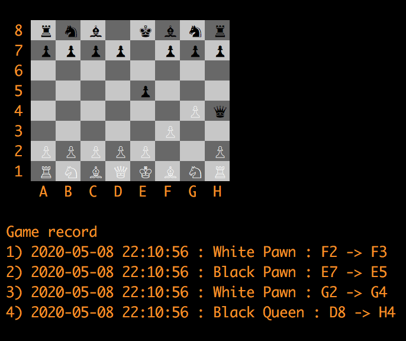
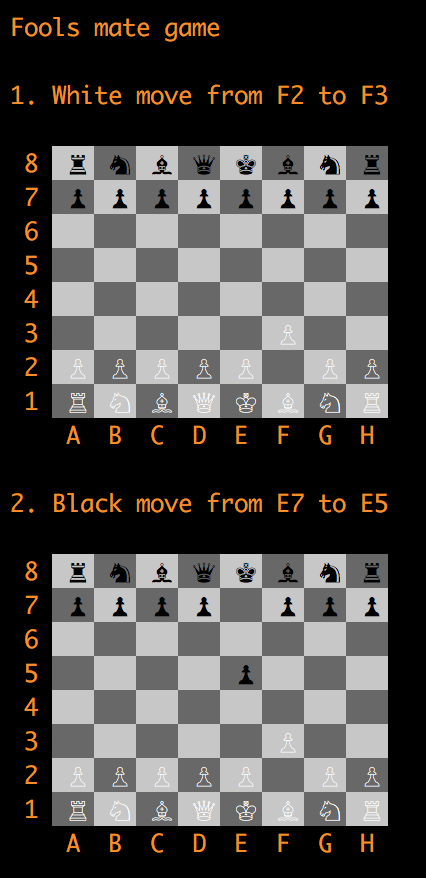
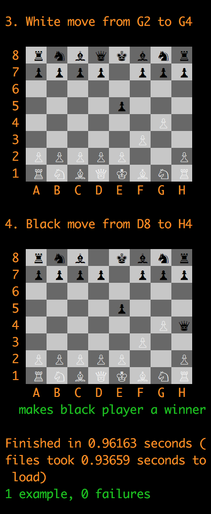

# Chess-api

This is an api rails application able to provide service to play store and analyze many chess games for many users.

It is created only for fun and in learning purposes so future development depends on many circumstances :)

## Configuration

### Requirements

Application has been created with **ruby 2.6.5** and **rails 6.0.3**. 

PostgreSQL is currently used to store users and games.
  

### Environment configuration
Simply use ```bundle install``` to install all required gems.  


### Database configuration
Copy and provide own credentials to database.yml : ```cp config/database.yml.example config/database.yml```

Prepare db and load some example data simply run : ```rake db:setup``` 

## Basic logic available in rails console

When seeds are loaded you can simply create a game involving any available users like :  

```game = CreateGame.new(creator: User.first, white_player: User.first, black_player: User.last).call```

Then you can create first move : ```MoveChessman.new(game, :F2, :F3).call```

And always display chessboard with : ```DrawBoard.new(game.board).call```

That should give you output like this :



## Development tools 

### Run pronto cops

You can run pronto with cops on whole code like :
```pronto run --commit=$(git log --pretty=format:%H | tail -1)```

Or examine changes made in own branch like : ```pronto run -r=flay rails_best_practices reek rubocop brakeman -c origin/master``` 
 
### Run specs
 Simply run whole suite with : ```rspec```

### Game specs with visualisation of the game 

There is a separate folder for whole game scenarios in spec/games

To see visualisation of the game set DRAW_BOARD variable before launch any single spec like:  

```DRAW_BOARD=true rspec spec/games/fools_mate_spec.rb```




